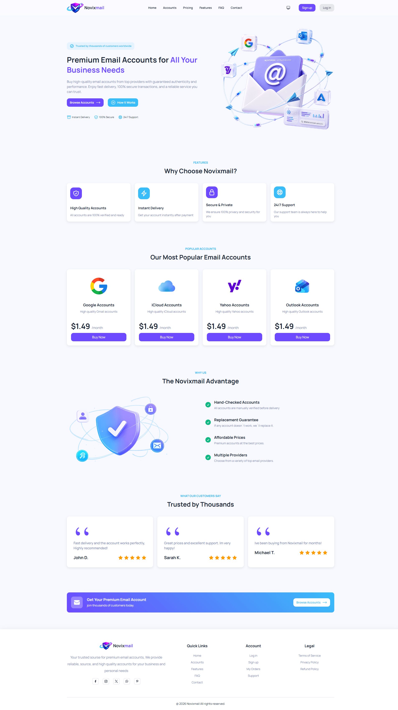
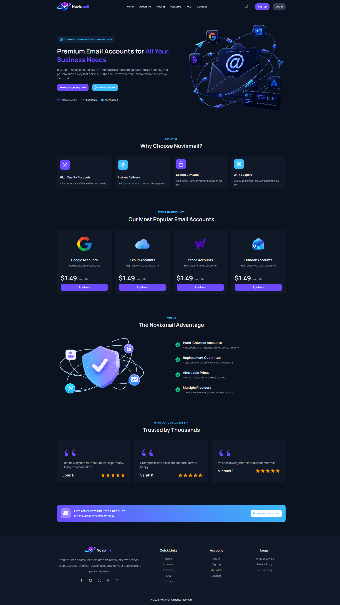
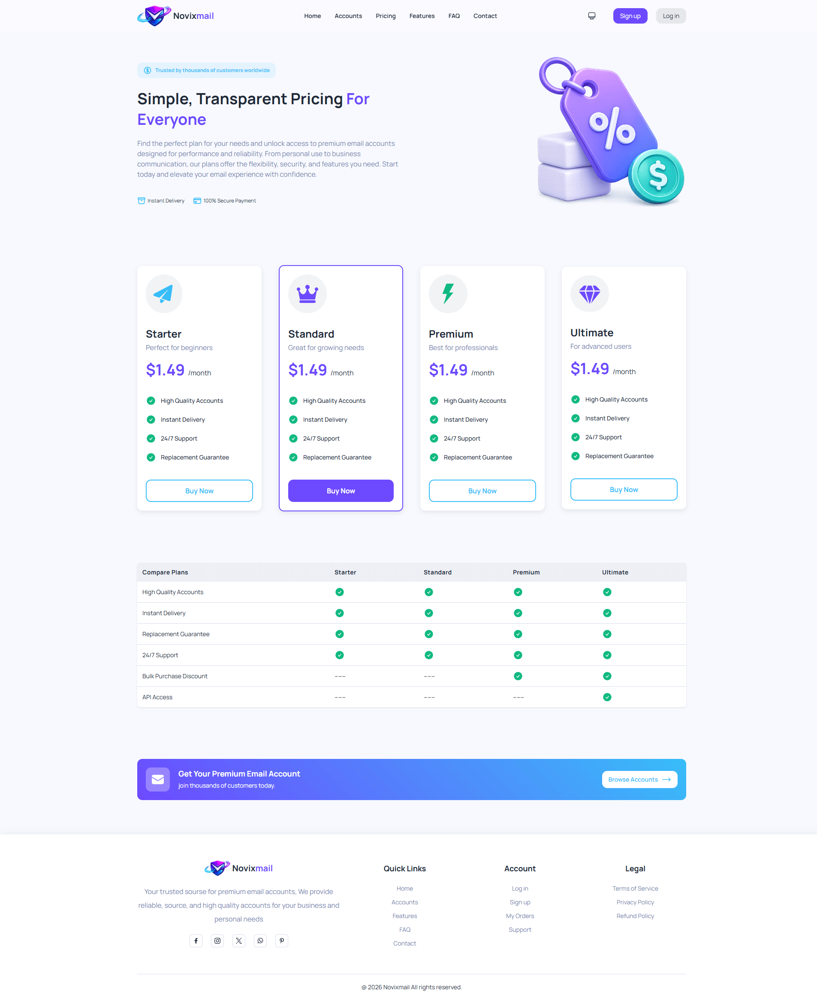
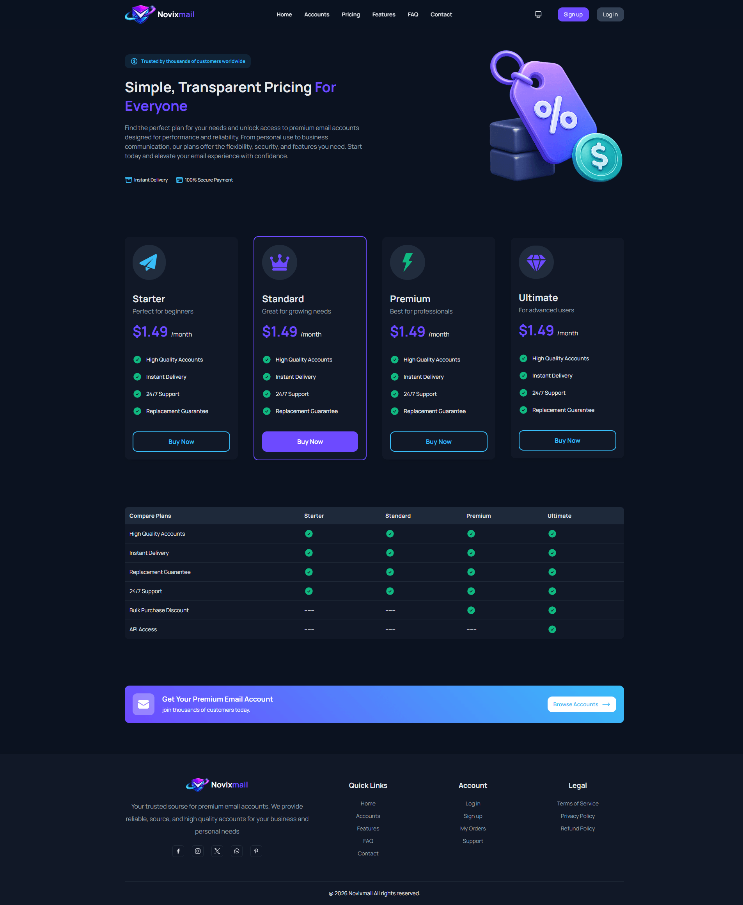

# NovixMail ✉️

> Modern WordPress theme for selling email accounts and online services.

<p align="center">
  
</p>

<p align="center">
  
  
  
  
</p>

---

## 📖 About

NovixMail is a modern WordPress theme developed for selling email accounts and online services.

The project focuses on clean UI, responsive layouts, dark mode support, and a modern user experience powered by Tailwind CSS.

The theme is currently under active development.

---

## ✨ Features

- Modern and responsive UI
- WordPress theme architecture
- Tailwind CSS integration
- Light Mode support
- Dark Mode support
- Mobile-first design
- Pricing page
- Service selling layout
- Modern user experience
- Custom PHP functionality
- JavaScript interactions

---

## 🛠 Tech Stack

- PHP
- WordPress
- Tailwind CSS
- JavaScript

---

## 🌗 Theme Modes

NovixMail supports two appearance modes:

- ☀️ Light Mode
- 🌙 Dark Mode

Users can switch between themes for a better experience.

---

## 📸 Screenshots

### Home Page

| Light Mode | Dark Mode |
|------------|-----------|
|  |  |

### Pricing Page

| Light Mode | Dark Mode |
|------------|-----------|
|  |  |

---

## 📂 Project Structure

```text
assets/
└── screenshots/
    ├── home-light.png
    ├── home-dark.png
    ├── pricing-light.png
    └── pricing-dark.png
```

---

## 🚀 Installation

Clone the repository:

```bash
git clone https://github.com/yourusername/novixmail.git
```

Move the theme into:

```text
wp-content/themes/
```

Activate the theme from the WordPress dashboard.

If Tailwind assets need rebuilding:

```bash
npm install
npm run build
```

---

## 🚧 Development Status

This project is currently under active development.

Upcoming features:

- Login page
- User dashboard
- Account management pages
- Checkout pages
- Additional UI components

---

## 📄 License

This project is intended for personal and educational purposes.

---

<p align="center">
Made with ❤️ using WordPress, PHP and Tailwind CSS.
</p>